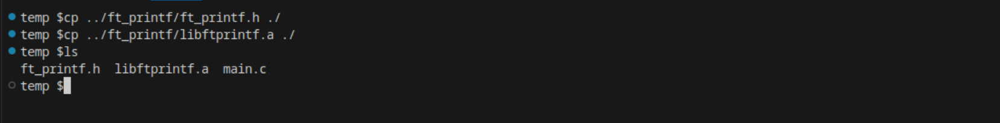
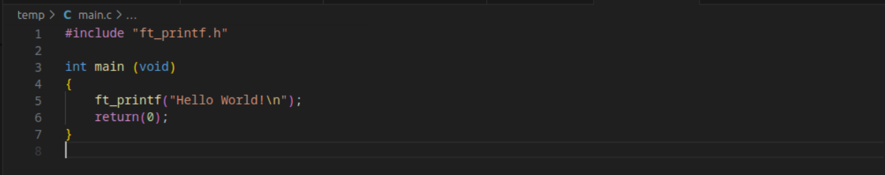
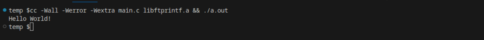
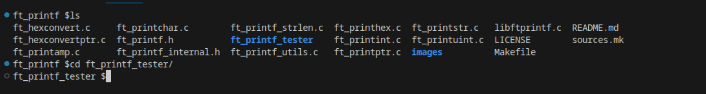
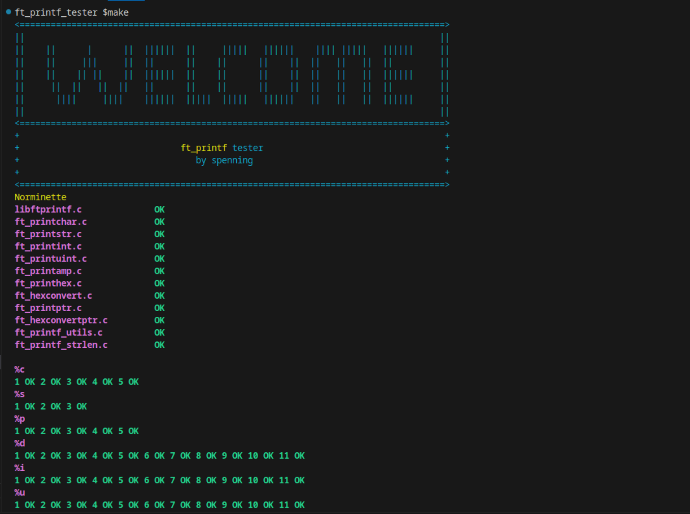

<!-- PROJECT LOGO -->

<br />
<div align="center">
  <a href="https://github.com/sebastianpenning/ft_printf">
    
  </a>

  <h3 align="center">ft_printf</h3>

  <p align="center">
    ft_printf is a 42 version of printf
    <br />
    <a href="https://github.com/sebastianpenning/ft_printf">
  </p>
</div>


<!-- ABOUT THE PROJECT -->

# About The Project

  
ft_printf is a project at Codam that teaches you about variadic variables and how they can be applied to re-engineer printf. In the project it was specifically stated not to reenact the buffer management of the original printf.


# Built With

* [![C][C]][C-url]

<!-- GETTING STARTED -->

# Getting Started


This is an example of how you may give instructions on setting up your project locally.

To get a local copy up and running follow these simple example steps.


# Installation
1. Clone the repo with --recursive flag, which is necessary for the tester


```sh

git clone https://github.com/sebastianpenning/ft_printf.git --recursive

```
2. cd into directory

```sh

cd ft_printf

```


3. Call the Makefile 

```sh

make

```

4. Copy libftprintf.a and ft_printf.h files over to working directory

```sh

cp {location} ft_printf.h {working directory}
cp {location} libftprintf.a {working directory}

```

<a href="https://github.com/sebastianpenning/ft_printf">
  
</a>

<!-- USAGE EXAMPLES -->

# Usage

1. Include libft.h file and libft function in project.

<a href="https://github.com/sebastianpenning/ft_printf">
  
</a>


2. Compile with cc

```sh
cc -Wall -Werror -Wextra {project_files.c} libftprintf.a && ./a.out
```

<a href="https://github.com/sebastianpenning/ft_printf">
  
</a>


# Tester

The libft tester includes tests for libft, printf, and get_next_line with both unit tests and norminette
tests for all files included. In the future memory tests are planned to be added.

1. cd into ft_printf_testser

<a href="https://github.com/sebastianpenning/libft">
  
</a>

2. Make tests

<a href="https://github.com/sebastianpenning/libft">
  
</a>


<!-- LICENSE -->

# License

Distributed under the MIT License. See `LICENSE.txt` for more information.


<!-- ACKNOWLEDGMENTS -->

# Acknowledgments

* [Codam](https://www.codam.nl/about-codam) 


<!-- MARKDOWN LINKS & resources/IMAGES -->


[license-url]: https://github.com/sebastianpenning/ft_printf/blob/main/LICENSE

[C]:https://img.shields.io/badge/-c-black?logo=c&style=social

[C-url]: https://www.learn-c.org/
  

